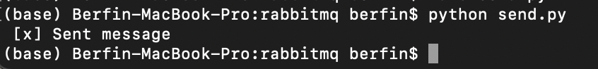
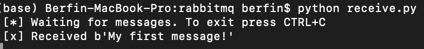
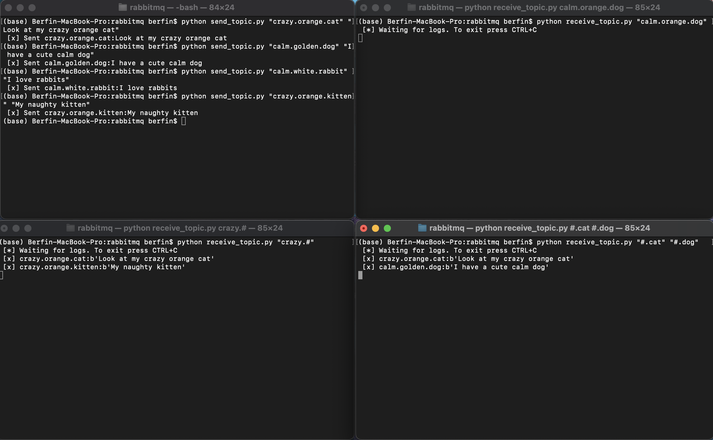

# RabbitMQ

## Sending and Receiving Messages with RabbitMQ using Python

Firstly we're going to install the Pika which is a Python client recommended by the RabbitMQ team.
```
python -m pip install pika --upgrade
```
Then, on the producer part, we're going to establish a connection with our RabbitMQ server via this client.
```
connection = pika.BlockingConnection(pika.ConnectionParameters('localhost'))
channel = connection.channel()
```
Next, we have to create the queue which our message is going to be delivered through.
```
channel.queue_declare(queue='queue_name')
```
But before it gets enqueued, our message needs to go through an exchange. We define a default exchange with the empty string and simply specify the queue name in the routing_key parameter. We pass our message with the body parameter.
```
channel.basic_publish(exchange='',
                      routing_key='hello',
                      body='Hello World!')
```
On the consumer side, we first connect to the RabbitMQ server as well. Since we may not know which program is going to be run first, to declare the same queue again is a good practice. 
Then, our consumer has to subscribe a callback function to the queue, in order to be informed whenever a new message arrives. 
```
def callback(ch, method, properties, body):
    print(f" [x] Received {body}")
```
Now we have to let RabbitMQ know that this callback function should receive messages from our queue.
```
channel.basic_consume(queue='hello',
                      auto_ack=True,
                      on_message_callback=callback)
```
As a result, we enter a loop that is waiting for data and runs callbacks when it's necessary.
```
channel.start_consuming()
```
Now our consumer listens constantly, and producer is able to send messages whenever it's run!




## Topic Exchange


